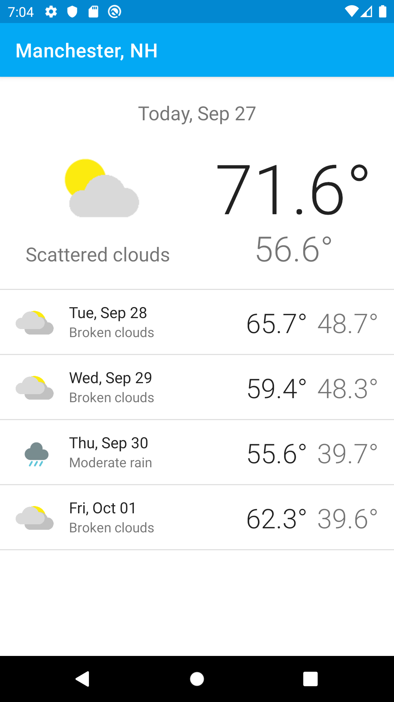
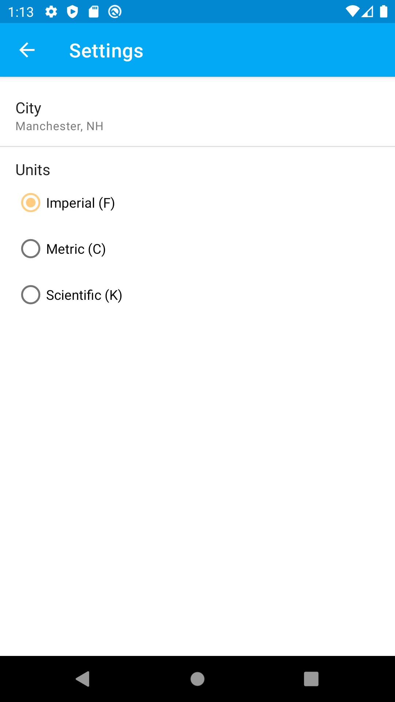
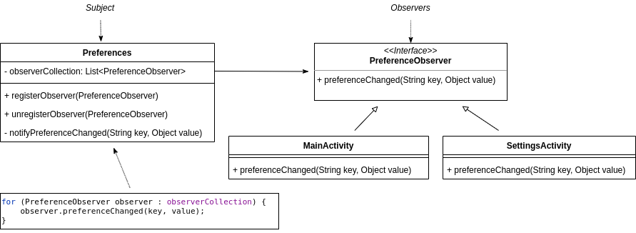

# Weather Forecast - Part 2
COMP 730/830 Lab 6

 

Powered by [Weatherbit.io API](https://www.weatherbit.io/api)

## Objectives
- Learn how to use and implement Observer Design Pattern.
- Introduce the Loose Coupling Principle.
- Learn how State Design Pattern is used.

## Instructions
1. Update API_KEY in `WeatherAPI`
```java
private static final String API_KEY = "YOUR_API_KEY";
```
2. Review Settings screen. Try changing city or measurement units preference. How does it affect forecast screen? Why?
3. Implement Observer pattern to notify objects about changes in the Preferences. In our implementation
`Preferences` will be the subject, that notifies its subscribers about updates. `MainActivity` and `SettingsActivity`
   will be the observers. They will wait for the updates to take further action.
See the diagram below for more details.

4. Check out `state-pattern` branch
```
git checkout -b state-pattern
```
5. Review how `MainActivity` uses State pattern to update its UI.
6. Draw a class diagram that shows relationship between `MainActivity` and its states. 
